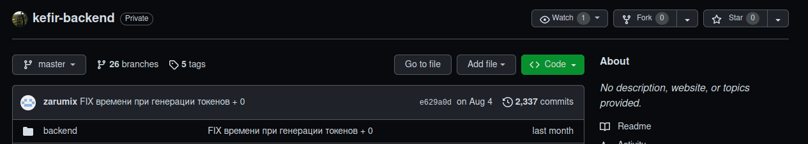
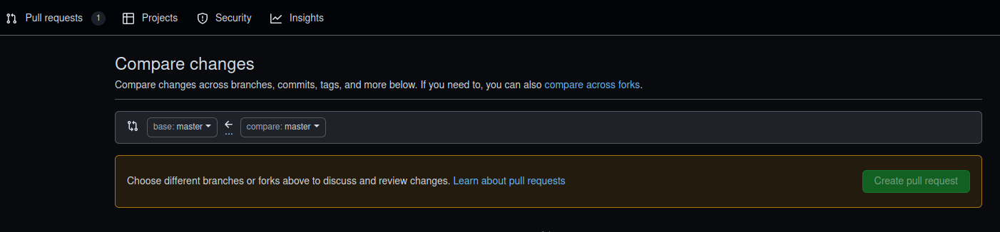
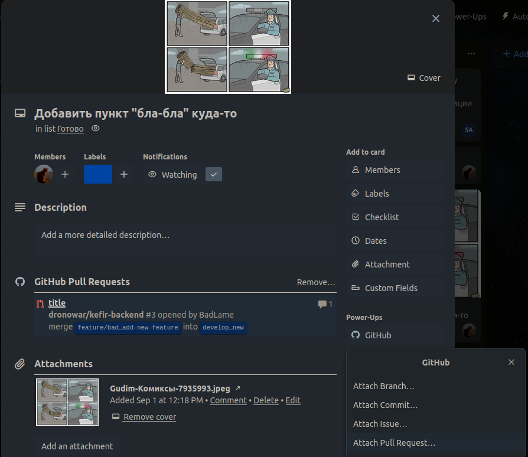

## Жизненный цикл задачи (чеклист)

Заметки:
  - Называя в пунктах ветку `develop` подразумеваю ветку, на которой идёт разработка для конкретного проекта (у кефира, например, `develop_new`)
  - Комиты в `master` (`master_new` для кефира) напрямую не делаются (когда такое происходит - обычно это случайность и исключение). `master` берёт все изменения с помощью `git merge develop`

1) Получение задачи:
   - Сразу (серьёзно) записать в трекер (в нашем случае - трелло)
   - Добавиться в созданную задачу - кругляш с аватаркой у задачи будет показывать, за кем она закреплена
   - При необходимости (если задача большая или плохо сформулирована) - добавить описание, наколько возможно понятное и простое
   - Пометить цветом (красный - фикс бага, синий - остальные изменения)

2) Работа:
   - Проставить в соответствующую колонку ("В работе", к примеру)
   - Проверить актуальность текущей ветки develop на локалке (git fetch && git status, git pull при необходимости)
   - Отпочковаться от ветки develop на ветку задачи (находясь на develop `git checkout -b <название новой ветки>`):
     * `fix/...` - ветка для починки бага, пример `fix/me_token-commission-sum-fix`
     * `feature/...` - ветка для остальных задач, пример `feature/badlame_making-some-shit`
     * Иногда необходимо внести неподгитовые изменения, к примеру - добавить ключ в `.env`. В этом случае стоит оставить комментарий по изменениям в карточке задачи (и упустить операции с гитом)
   - Решение задачи, комит

3) Выгрузка решения:
   - Снова проверить актуальность локальной `develop`, не актуальна - обновить и `git rebase develop` с ветки текущей задачи (почти то же, что и мерж)
   - Пуш (в комментарии к комиту будет здорово оставлять вразумительные сообщения, что в нём было сделано)
   - Зайти на github в репозиторий проекта, примерно в этом месте появится кнопка `Create pull request` 
   - Во время создания реквеста убедиться, что левой веткой будет выбрана `develop` 
   - Создать
   - В трелло привязать свежесозданный пулл реквест к карточке задачи (кнопа github в карточке) 

4) После выгрузки:
   - Если заранее никто не просил "не торопиться и скинуть посмотреть" - у каждого хватает прав аппрувнуть собственный реквест (таким образом, он автоматически мержится в `develop`)
   - Зайти на сервер соответствующего проекта, запустить `git pull` (в нашем случае - будучи на ветке `develop`, разумееется), при необходимости запустить artisan команды и тд
   - В последствии, если по задаче всё ок - забыли, не ок - возвращаемся на локалке на ветку и начинаем сначала с **пункта "3"**
